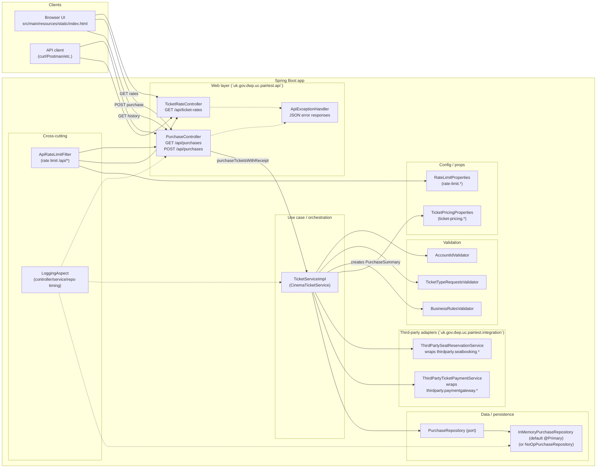

# Cinema Tickets (Java)

This module implements the cinema ticket purchase kata:

- Validates purchases against the exercise rules
- Calculates total amount + seats
- Calls the provided third-party services
- Persists successful purchases via a repository port (clean-architecture style)

## Requirements

- Java 21
- Maven 3.x

## Demo (deployed)

To see the app in action, visit:

- `https://dwp-cinema-tickets.onrender.com/`

Note: this runs on a **free** hosting tier. If the service is sleeping, the first request can take a bit longer while it wakes up (cold start).

## Run locally

From `cinema-tickets-java/`:

```bash
# Run the full test suite
mvn test

# Start the app
mvn spring-boot:run
```

Then open:

- UI: `http://localhost:8080/`
- Swagger UI: `http://localhost:8080/swagger-ui/index.html`
- OpenAPI JSON: `http://localhost:8080/v3/api-docs`

## Run tests

From `cinema-tickets-java/`:

```bash
mvn test
```

## Unit test report (Surefire)

From `cinema-tickets-java/`:

```bash
mvn verify
```

This generates an HTML unit test report at:

- `target/site/surefire-report.html`

## Test coverage report (JaCoCo)

From `cinema-tickets-java/`:

```bash
mvn test
```

This generates an HTML coverage report at:

- `target/site/jacoco/index.html`

## Rate limiting

Requests to `/api/*` are rate-limited (token bucket). When exceeded, the API returns **HTTP 429** with a JSON `ApiErrorResponse` payload.

Configuration in `application.properties`:

- `feature.rate-limit.enabled`: enable/disable (default: `true`)
- `rate-limit.capacity`: bucket size (default: `5`)
- `rate-limit.refill-tokens`: tokens refilled per period (default: `5`)
- `rate-limit.refill-period`: ISO-8601 duration (default: `PT10S`)

## Business rules enforced

- `accountId` must be non-null and `> 0`
- At least one `TicketTypeRequest` must be supplied
- Each request must have:
  - non-null type
  - ticket count `> 0`
- Total tickets (adult + child + infant) must be `<= 25`
- Child and/or infant tickets require at least 1 adult ticket
- Infants must not exceed adults (each infant sits on an adult’s lap)

## Pricing & seats

- **Prices**:
  - Adult: 25
  - Child: 15
  - Infant: 0
- **Seats allocated**: adult + child (infants do not allocate seats)

## Code structure (clean architecture-ish)

- **Use case / orchestration**: `uk.gov.dwp.uc.pairtest.TicketServiceImpl`
- **Domain**:
  - `uk.gov.dwp.uc.pairtest.domain.TicketTypeRequest`
  - `uk.gov.dwp.uc.pairtest.domain.TicketPrice`
  - `uk.gov.dwp.uc.pairtest.domain.Purchase`
- **Validation**: `uk.gov.dwp.uc.pairtest.validation.*` (validator pattern)
- **Port**: `uk.gov.dwp.uc.pairtest.repository.PurchaseRepository`
- **Adapters**:
  - `uk.gov.dwp.uc.pairtest.repository.NoOpPurchaseRepository` (default)
  - `uk.gov.dwp.uc.pairtest.data.InMemoryPurchaseRepository`
- **Third-party services (do not edit)**: `thirdparty.*`

## Architecture diagram



### End-to-end request flow (purchase)

- **Client**: browser UI (or any HTTP client) calls `POST /api/purchases`
- **Web layer**: `PurchaseController` validates API-level business rules + maps input to domain `TicketTypeRequest[]`
- **Use case**: `TicketServiceImpl` performs input validation, computes totals, checks business rules, then:
  - reserves seats via `ThirdPartySeatReservationService`
  - makes payment via `ThirdPartyTicketPaymentService`
  - persists the successful `Purchase` via the `PurchaseRepository` port (default: `InMemoryPurchaseRepository`)
- **Cross-cutting**:
  - `/api/*` is rate-limited by `ApiRateLimitFilter` (HTTP 429 on exceed)
  - controllers/services/repos are timed by `LoggingAspect`
  - errors are normalized to JSON by `ApiExceptionHandler`

